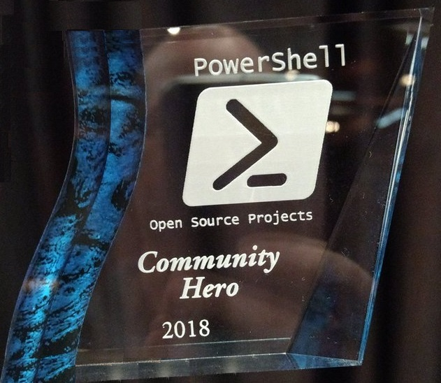

I appreciate having the opportunity to connect with everyone from the community at the 2018 PowerShell and DevOps Summit. There were so many great contributers that I have followed for a long time that I was able to finally meet in person.

One thing that I did not expect was the impact that I was having on the community. I was very honored to have people reaching out to me the entire conference to thank me for helping them. The community has been a good resource for me and I am doing what I can to give back to it. I could see my internet points doing well but it means so much more when someone goes out of their way to say thank you.

I am also honored to be recognized as a PowerShell Community Hero by the PowerShell team at the summit.

This year they asked the community for nominations. This was a way for the PowerShell team thank those people that make the community a better place. I am grateful to both the PowerShell team and the community for their support.

Thank you.

-Kevin
