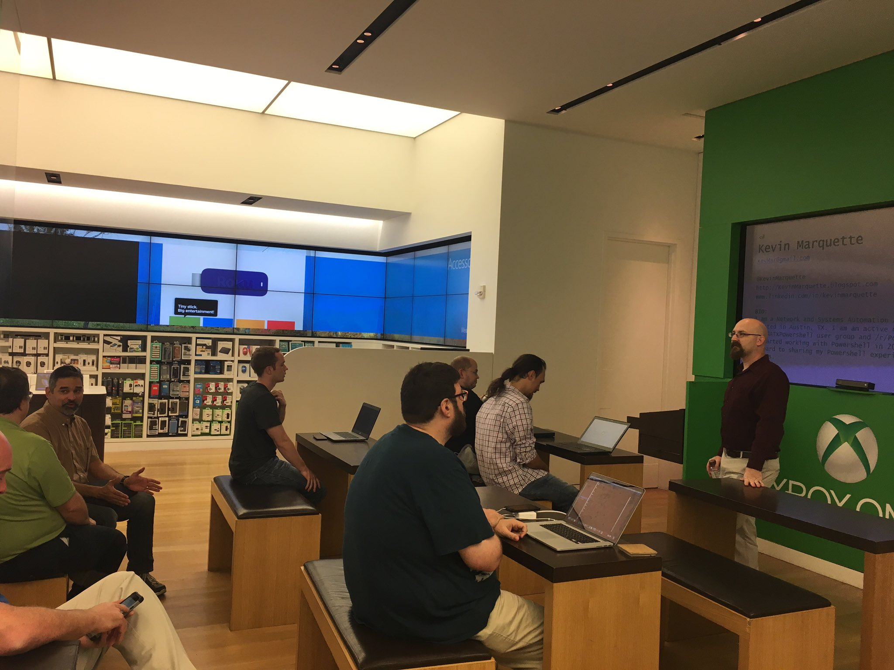

We had a great turnout for our Austin Powershell User Group meeting this month. We have been presenting out of the Microsoft store in the Domain for one year now. The Microsoft store has been a good host for us.

I was the speaker this month and my talk was about the common issues that admins run into when they start using Powershell. It is not so much about issues with Powershell itself but the typs of issues you may have because you are using Powershell. With Powershell, you approach some common problems differently. 

I also spend a lot of time helping people at http://www.reddit.com/r/Powershell so I get to see common classes of problems over and over. I took my experiences from working with those users and turned into a talk for this months user group.

I am going to be working on a series of blog post addressing most of the items that I talked about in that session. 